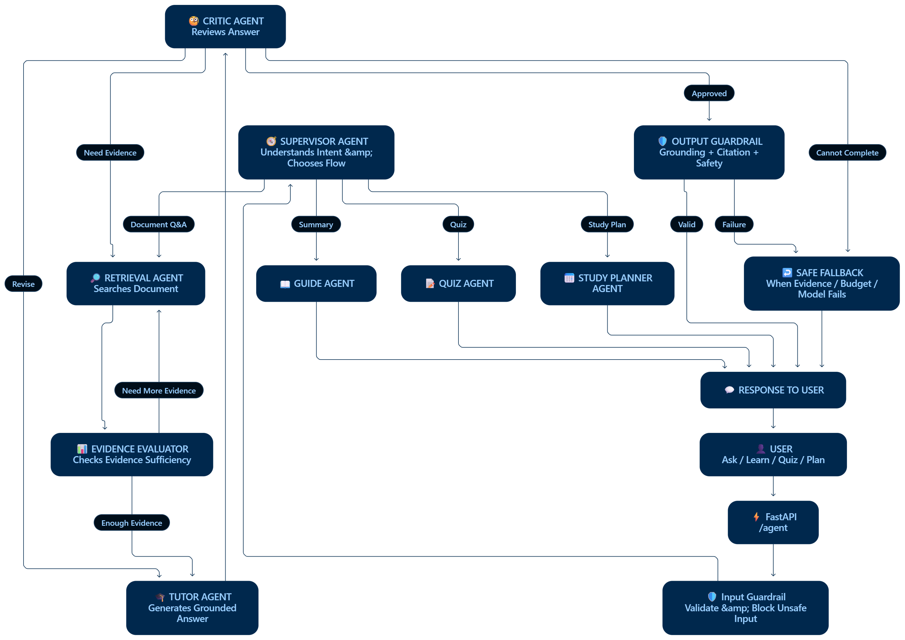

# 🧠 Document Grounded AI Tutor Guide

*A document-grounded AI tutor for learning from your own PDFs.*

### ✨ Features
- 📄 PDF-based RAG learning
- 💬 Grounded AI tutoring with memory
- 📝 Adaptive quizzes and scoring
- 📊 Performance tracking
- 📅 Personalized study plans
- 🤖 Controlled multi-agent workflow
 

### 🏗️ Architecture

  

 

### 🛡️ Guardrails

Input validation · Prompt-injection checks · Evidence validation · Output grounding · Citation checks · Workflow limits

 

### 📈 Evaluation

| Metric | Baseline RAG | Agentic RAG |
|---|---:|---:|
| Recall@4 | 0.90 | 0.90 |
| Answer Similarity | 0.847 | 0.922 |
| Groundedness | 0.486 | 0.837 |
| Faithfulness | 1.00 | 0.98 |

 

### 🔍 Observability
**LangSmith** traces agent decisions, retrieval, revisions, latency, and model calls.

 

### 🛠️ Tech Stack
`FastAPI` · `LangGraph` · `Gemini` · `ChromaDB` · `SQLite` · `LangSmith` · `React` · `Vite` · `Tailwind`
